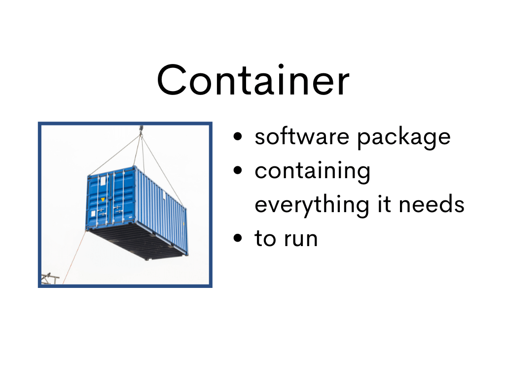
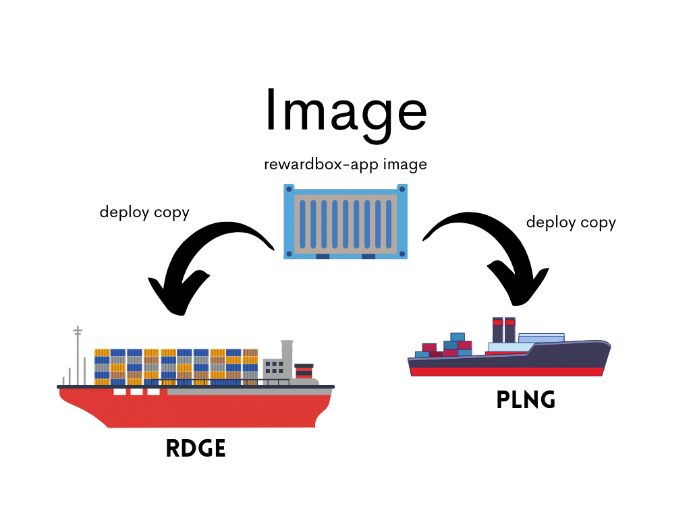

## Images and Containers






1. On your local terminal, change directory to *hello-campaigns* directory:

```bash
cd hello-campaigns
```

2. Using any text editor, open the file *Dockerfile* and change the message at the *CMD* line to your desired message

```Dockerfile
FROM alpine:latest

CMD ["echo", "Hello Rizi!"]
```

3. Build the Docker Image out of the Dockerfile:

```bash
docker build --tag hello-campaigns:v1 .
```

**Note 1:** *hello-campaigns* is the Docker Image name and *v1* is the tag of the built image above

1. List the Docker Images registered in your local

```bash
docker image ls
```

Or, you can simply execute the command:

```bash
docker images
```

What was the output of the command? Did you see the Docker Image which you've just built?

5. Build the image without tag

```bash
docker build --tag hello-campaigns .
```

6. List again the Docker Images registered in your local

```bash
docker image ls
```

What did you notice in the output?

7. Let's execute the Docker Image as a container

```bash
docker run hello-campaigns:v1
```

8. Also, try to execute the latest tag of the same image

```bash
docker run hello-campaigns
```

or, using the following:

```bash
docker run hello-campaigns:latest
```

9. Delete the image from your local registry

```bash
docker image rm -f hello-campaigns:v1
```

10. List the Docker Images again, and you should not see *hello-campaigns:v1* anymore

```bash
docker image ls
```

11. Copy the IMAGE ID of *hello-campaigns:latest* and supply the value to the Delete Docker Image command below:

```bash
docker image rm -f <IMAGE ID of the Docker Image>
```

12. List the Docker Images again, and you should not see *hello-campaigns:latest* anymore

```bash
docker image ls
```


[Back to Top](../README.md) | [Previous](./../02/container-platforms.md) | [Next](./../04/adding_files.md)
