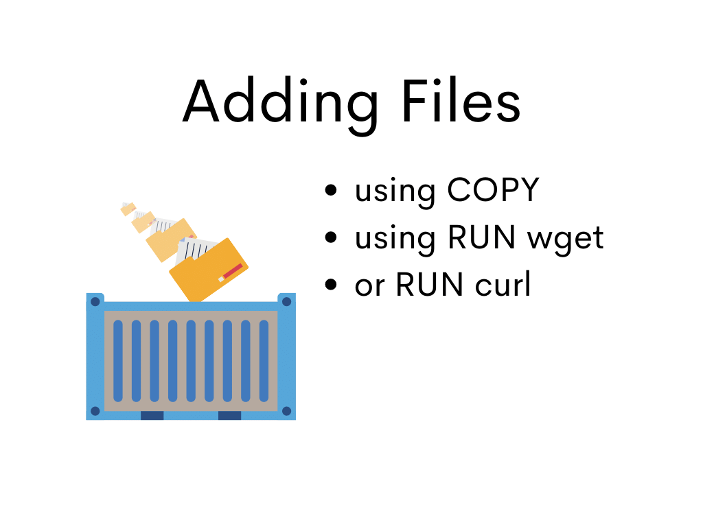

## Adding Files to Image




1. Change directory to *campaigns-node-14*

```bash
cd ../campaigns-node-14
```

2. Let's open and examine the Dockerfile inside the directory:

```Dockerfile
FROM ubuntu:latest

COPY node-v14.18.2-linux-x64.tar.gz .

RUN tar xvf node-v14.18.2-linux-x64.tar.gz

ENV PATH=${PATH}:/node-v14.18.2-linux-x64/bin
```

3. Let's build the Docker Image

```bash
docker build --tag campaigns-node-14 .
```

4. Execute Docker Image

```bash
docker run --interactive --tty campaigns-node-14:latest
```

Shortcut version of the command above is

```bash
docker run -it campaigns-node-14:latest
```

In the shell prompt, type

```bash
node -v
```

You should see the version of Node in the output.

5. Change directory to *campaigns-node-16*

```bash
cd ../campaigns-node-16
```

6. Open and examine the Dockerfile inside the directory

```Dockerfile
FROM ubuntu:latest

RUN apt update
RUN apt install -y wget

RUN wget https://nodejs.org/download/release/v16.13.1/node-v16.13.1-linux-x64.tar.gz

RUN tar xvf node-v16.13.1-linux-x64.tar.gz

ENV PATH=${PATH}:/node-v16.13.1-linux-x64/bin
```

7. Build Docker Image

```bash
docker build --tag campaigns-node-16 .
```

8. Execute Docker Image

```bash
docker run -it campaigns-node-16:latest
```

In the shell prompt, type

```bash
node -v
```

You should see the version of Node in the output.


[Back to Top](../README.md) | [Previous](../03/images_and_containers.md) | [Next](./../05/mounting_volumes.md)
