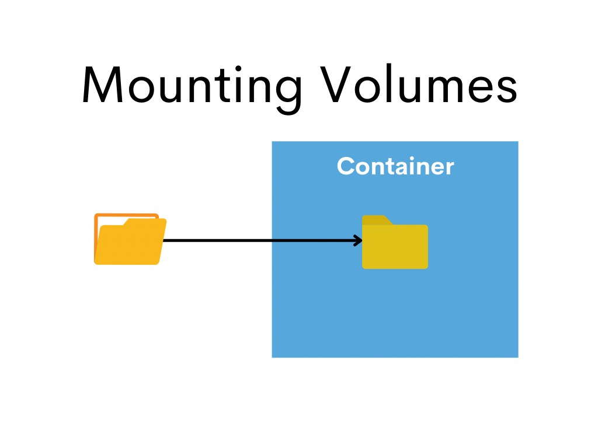

## Mounting Volumes




1. Change directory to *campaigns-node-builder*

```bash
cd ../campaigns-node-builder
```

2. Open and examine the content of the Dockerfile inside the directory

```Dockerfile
FROM campaigns-node:v16

VOLUME [ "/usr/src/node" ]

WORKDIR /usr/src/node

CMD [ "npm", "run", "build" ]
```

3. Build the Docker Image so, we can use it to build our Vue project

```bash
docker build -t campaigns-node-builder .
```

4. Now, let's change directory to our Vue project

```bash
cd ../my-vue-project
```

5. Build the project using the Docker Image we've just built

```bash
docker run --volume ${PWD}:/usr/src/node campaign-node-builder:latest
```

You should see a dist folder created under the project folder.


[Back to Top](../README.md) | [Previous](../04/adding_files.md) | [Next](../06/environment_variables.md)
