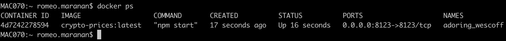
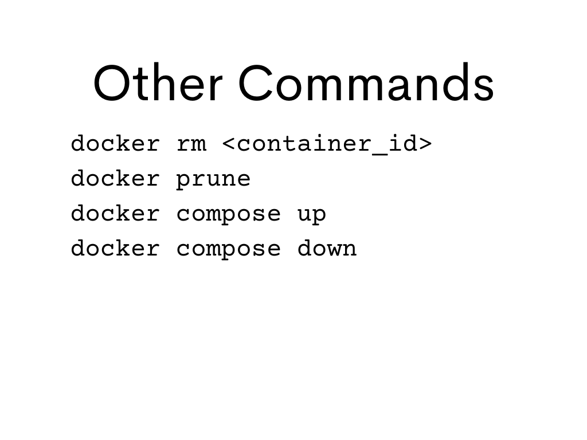

## Other Useful Docker Commands


1. Take note once your Docker Image is built, it's already registered into your machine's own Docker Registry. So, which ever directory you are in the terminal you should be able to execute those Docker Images

```bash
cd ~
docker run -it --publish 8123:8123 crypto-prices:latest
```

2. Stop the running crypto-prices app and try to run it again using the following command

```bash
docker run --detach --publish 8123:8123 crypto-prices:latest
```

**Note:** The shortcut for the parameter is -d, so the following does the same thing as above

```bash
docker run -d -p 8123:8123 crypto-prices:latest
```

What happened after you execute either one of the command above?

3. List all the containers currently running

```bash
docker container ls
```

**Note:** You may also list containers using the following

```bash
docker ps
```

Examine the output. What fields and values can you see?



4. Stop the running *crypto-prices* app using the following command

```bash
docker stop <CONTAINER_ID>
```




[Back to Top](../README.md) | [Previous](../06/environment_variables.md) | [Next](../08/docker_registry.md)
