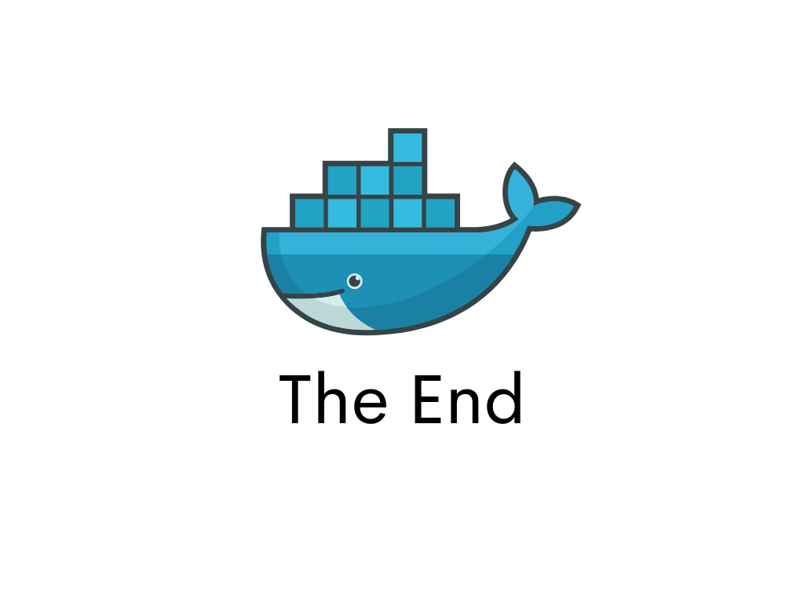

## Docker Registry


1. Visit hub.docker.com and login as teammocha (password: Password20)
2. Go to your terminal and login as teammocha

```bash
docker login --username teammocha
```

3. Change directory to *hello-campaigns*

```bash
cd ../hello-campaigns
```

4. Build the Docker Image using this template

```bash
docker build -t teammocha/hello-<your name> .
```

5. Push the Docker Image to Docker Hub

```bash
docker push teammocha/hello-<your name>
```

6. Visit hub.docker.com again and see if your image was uploaded.

7. Use another teammates image by running their tag

```bash
docker run -it teammocha/hello-rizi
```

You should be able to use the image shared by your peers.




[Back to Top](../README.md) | [Previous](../07/other_commands.png)
